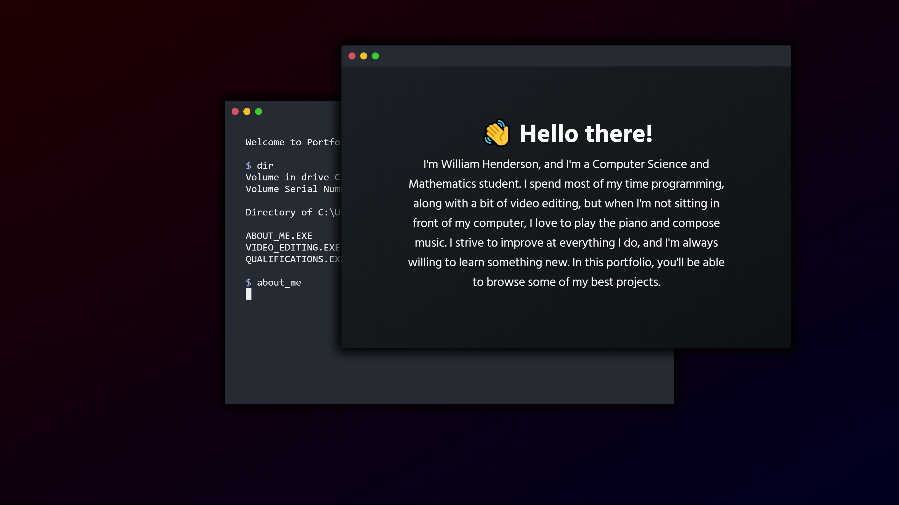
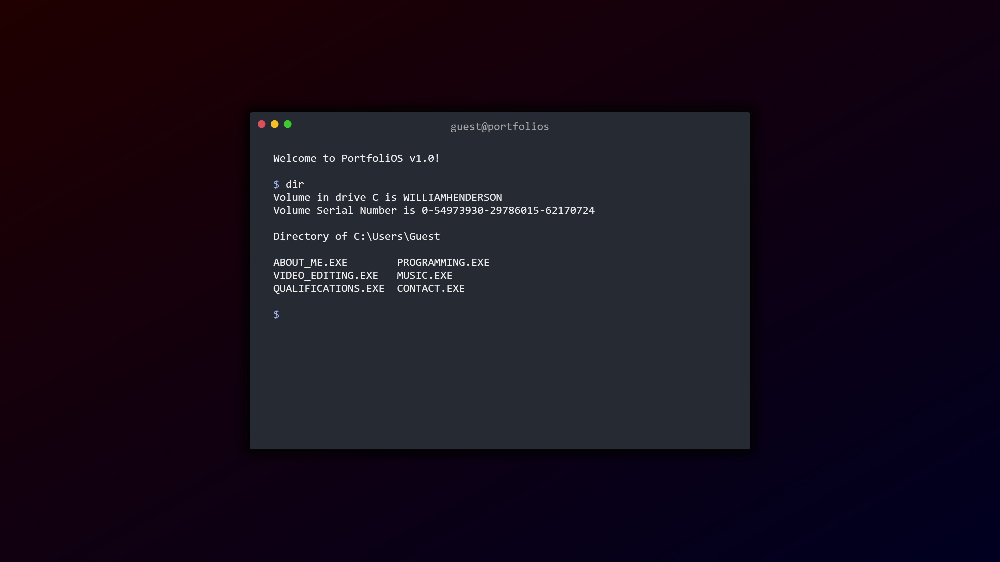

# PortfoliOS
This is my portfolio which showcases my most impressive work, not just on GitHub. You'll find a bit about myself as well as programs, music, and videos. But there's a twist: it's in a terminal.

## Why did you put your portfolio in a virtual terminal?
The whole point of any portfolio is to stand out from the others, and in my case, that's my a unique formatting choice of a terminal. I've tried to make it as easy to understand as possible, even for non-tech-savvy viewers. All one needs to do is run the 'help' command if they're stuck and they're on their way.

## Can I fork it and use it for myself?
I don't think I can stop you, as long as you credit me, but I'd prefer you not to, as the whole idea of it being unique pretty much disappears if multiple people have it. Feel free to take inspiration from it though!

## Why aren't phones and tablets supported?
Functionally, you need a physical keyboard to interact with the console. Practically, their screens are too small to see it properly anyway even if it was scaled. I'll probably make it redirect to a specially-designed mobile portfolio when I get around to it.

# Screenshots

